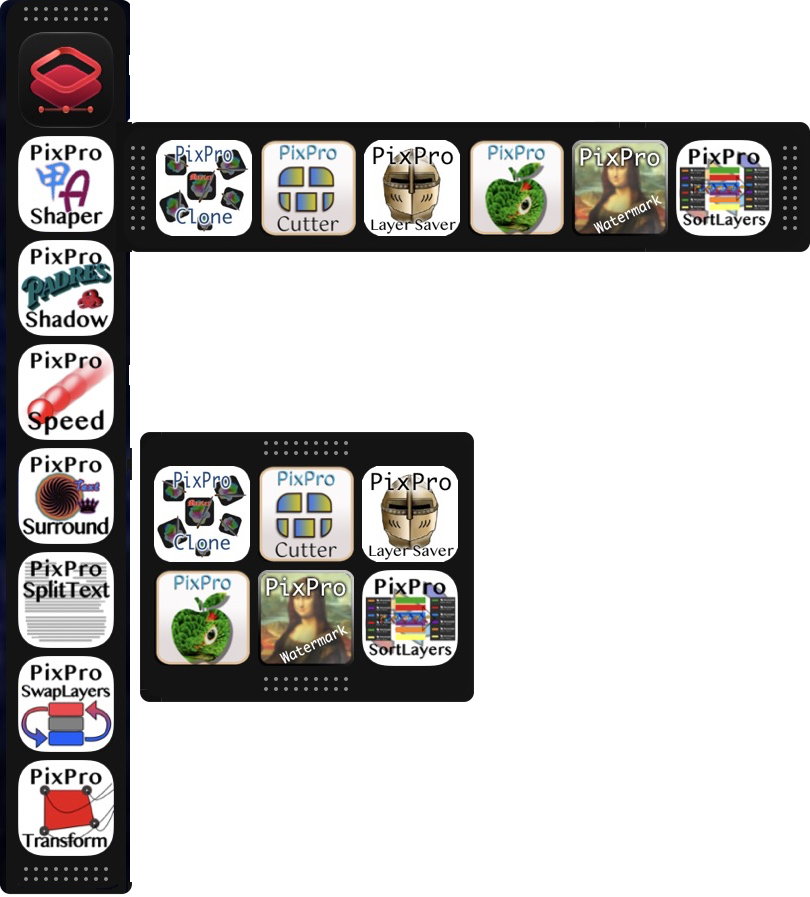

# Flache 1.7.4

A floating dock for the applications you choose, for macOS.

Flache (pronounced "flash") is a small floating icon panel to contain your
favorite applications, similar to the Mac Dock. But Flache can be dragged
anywhere on the display, in strip, column or grid format, floating above all
windows on every desktop. Add and remove applications with a right-click, and
show or hide Flache with a keyboard combination.

### [⬇︎ Download the latest release](https://github.com/spurious-cox/flache/releases/latest)

Notarized and stapled by Apple — open the DMG and drag Flache to
Applications. Or with Homebrew:

    brew install --cask spurious-cox/tap/flache

**Updating: quit Flache first** (menu bar F → Quit Flache). Force-quitting
counts as a crash, and the login agent will bring the old copy straight back.

    ⌃⌥⌘F        show or hide Flache

## Using it

* **Click** an icon to open the application, or bring it forward if it is
  already running. Flache never takes the focus from the app you are in.
* **Right-click** for the application's own Help when it carries some (a
  Read Me or a Help book), otherwise Flache Help, then Panels, Move to,
  Copy to, New…, the three arrangements (Grid, Column and Strip), Hide
  Flache, Recents (if
  available), Locate (shows the application in the Finder) and, at the
  bottom, Delete.
* **Recents** are the same list the Dock shows; choose one to open it.
  They need Full Disk Access (below), and only applications that keep such
  a list have one.
* **New…** adds applications after the icon you right-clicked. Applications
  already in Flache are grayed out. You can also drag applications from the
  Finder onto Flache.
* **Drag an icon** to move it. The icons part and a blue bar shows where it
  will land. Let go off Flache and nothing changes.
* **Drag a grip** (the dotted bars at both ends) to move Flache. Each
  arrangement remembers where you left it.
* An icon drawn **faded** is an application Flache can no longer find.

The Old English F in the menu bar holds About Flache, Preferences…, Help…,
Check for Updates…, Panels, Show/Hide Flache and Quit.

## Panels

Flache can keep several named panels — say PixPro, ArtText and Affinity —
each with its own applications, arrangement and places. One is on screen at
a time. Choose a name under **Panels** (right-click, or the F in the menu
bar) to swap it in where you last left it. **New Panel…** starts an empty
one; **Rename…** and **Delete…** act on the panel on screen. Right-click an
icon and choose **Move to** or **Copy to** to put it in another panel. Icon
size and the show/hide keys are shared by every panel.

## Preferences

* **Show / hide** — record any key sequence with at least one of ⌃ ⌥ ⌘.
* **Arrangement** — strip, column or grid.
* **Icon size** — small, medium or large.
* **Open Flache at login** — starts Flache when you log in and restarts it
  if it ever stops unexpectedly, so the key sequence always works. Quit
  from the menu bar and it stays quit until you next log in. Only one copy
  ever runs, so adding Flache to Login Items as well is harmless.

Flache needs no Accessibility or Input Monitoring. Giving it **Full Disk
Access** (System Settings → Privacy & Security → Full Disk Access) allows
**Recents** in the right-click menu, if available: the documents that
application opened recently, which macOS protects. Without it everything
else works and the menu has no Recents.

## Building

    ./venv/bin/python test_flache.py      headless checks + test_render*.png
    ./build.sh                            build, sign and install to /Applications
    ./build.sh --no-install               build and sign into dist/ only
    ./release.sh                          notarize + staple app and DMG, update the cask

The version lives in one place — `APP_VERSION` in `flache.py`. Replacing
`flache.png` and running `./build.sh` rebuilds both app icons.

## Files

    flache.py            the whole app
    test_flache.py       headless checks and the panel renders
    make_icon.py         menu bar glyph and icon/Flache.icns from flache.png
    flache.png           the icon artwork
    setup.py             py2app bundle
    build.sh             build, sign, install
    release.sh           notarize and staple app + DMG
    flache.entitlements  hardened-runtime entitlements

© 2026 Tim McCoy.

## Problems or suggestions

Open an issue: https://github.com/spurious-cox/flache/issues
